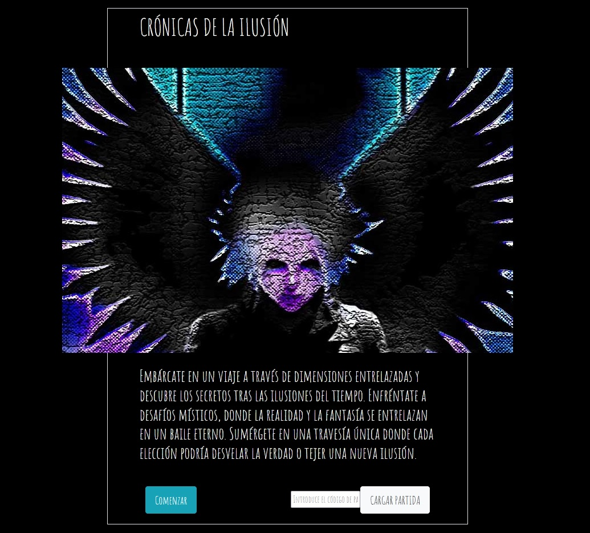
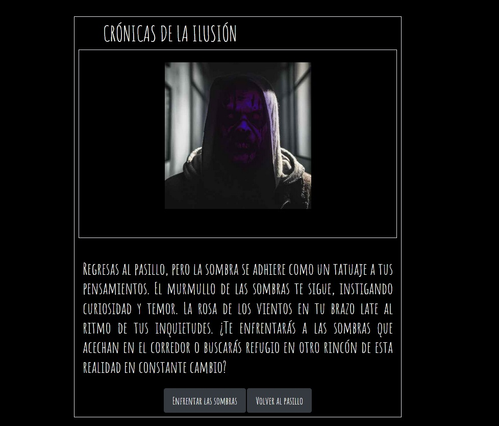

# decisionforge
This is a experiment to create an interactive adventure book for PC, catering to narrative rogue-like games, all within a web-based environment (PHP).

Set up a local development server and access it from your favorite web browser.  

# Explaination
In this example, we have the fictional game 'Crónicas de la Ilusión' as a reference. The script of the game has been created by ChatGPT and images are also AI generated with Stable Diffusion based on ChatGPT script. This is a example on how to create a easy framework for interactive adventure book-type games. You can edit the world file to create new rooms and options in the following format: 

    Unique identifier;Description;Button 1 text[Destination identifier];Button 2 text[Destination identifier];Button 3 text[Destination identifier]...

Unique identifier: An alphanumeric string of any kind. Identifies the level.

Description: Text displayed when the level is loaded.

Button text: Text for one of the displayed options.

[Destination identifier]: The identifier of the world to which we'll go when that button is pressed. 

Important: You can add as many buttons (options) as you want, just keep adding Text button + identifier. 

Images: Every time the script loads a screen, it loads the image whose name is the same as the ID and is in the 'images' folder, with the JPG extension. Just place the image there with the name matching the ID. Example: ID: AAAAAAAAA, image: AAAAAAAAA.jpg

To keep your actual game state, simpy copy the UI in the actual URL (i.ex. ayyYprXF4uHg4N7Gcpk6). In the home page, you will find a textbox to paste it and go to that screen directly.

